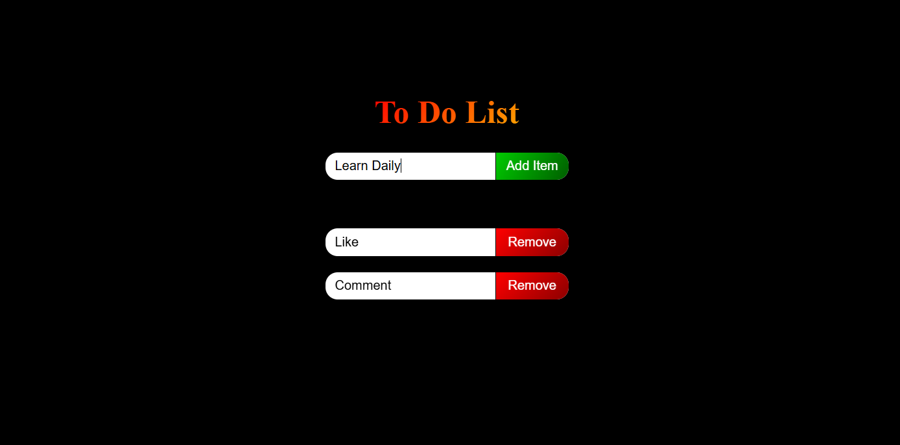

# To-Do List App 📝

A simple and interactive To-Do List application built using **HTML**, **CSS**, and **JavaScript**. This app allows users to organize their tasks effectively by adding and removing items from their list.

---

## Features 🚀

- **Add Tasks:** Input your tasks and add them to the list with a single click.
- **Remove Tasks:** Delete tasks easily by clicking the "Remove" button.
- **Keyboard Support:** Press `Enter` to add tasks quickly without using the mouse.
- **Responsive Design:** Works seamlessly on all screen sizes.
- **Modern UI:** A clean and visually appealing design with gradient styles.

---

## Preview 👀



---

## How to Use 📋

1. Clone this repository:
   ```bash
   git clone https://github.com/Tamilselvan6/daily-javascript-tasks.git
   ```
2. Navigate to the project folder:
   ```bash
   cd todo-list
   ```
3. Open `index.html` in your browser to run the app.

---

## Technologies Used 🛠️

- **HTML:** For the basic structure of the app.
- **CSS:** For styling and layout.
- **JavaScript:** For interactive functionality.

---

## Future Enhancements ✨

- Add task persistence using Local Storage.
- Enable drag-and-drop sorting of tasks.
- Add a feature to edit tasks directly.
- Include dark and light theme options.

---

## License 📜

This project is open-source and available under the MIT License.

